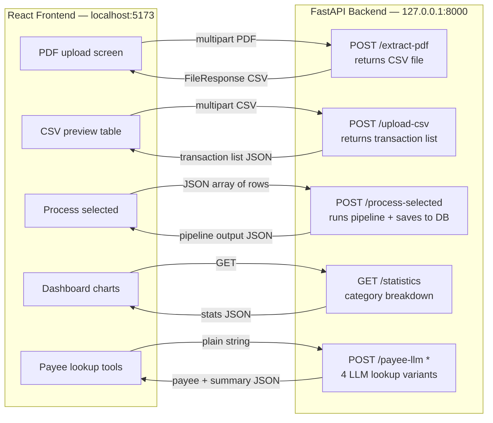
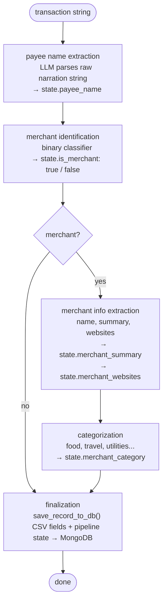
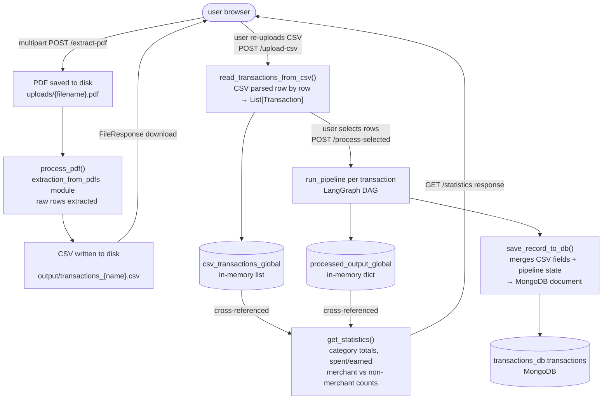
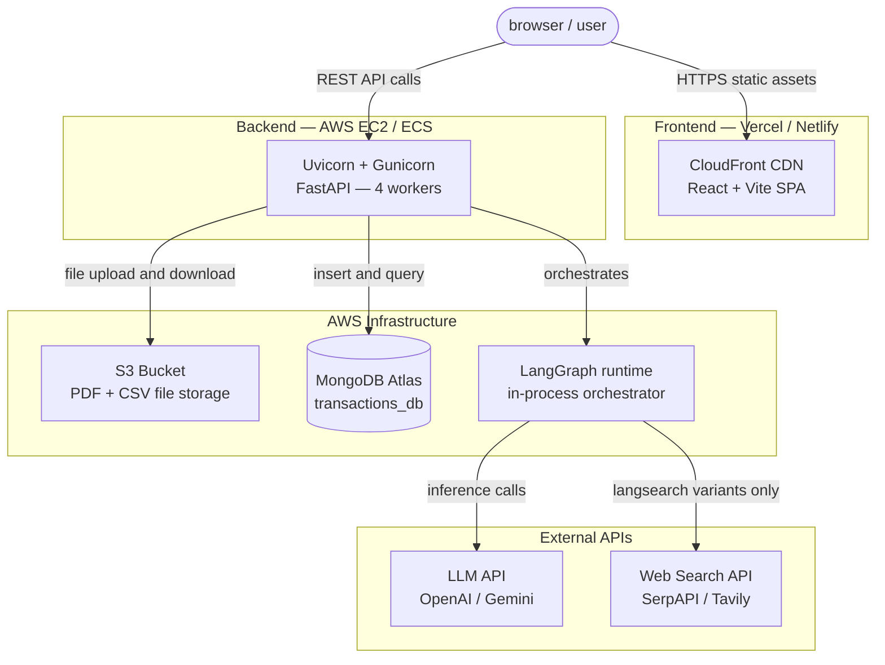

# Credit Mitra – Full System Documentation

## Overview

**Credit Mitra** is an end-to-end AI-powered pipeline for processing banking transaction narration strings. It takes raw PDF bank statements or CSV transaction files, extracts structured data, identifies merchants, extracts payee names, categorizes transactions, and stores the results in a database — all orchestrated via LangGraph and exposed through a FastAPI backend with a React frontend.

**Core Use Case**: Financial institutions and fintech apps need to transform messy, unstructured narration strings (like `"UPI/DR/123456789/ZOMATO/YESB/somecode"`) into clean, structured, categorized records.

**Project Plan**:
You can find the project plan [Here][].
<!-- Link Definitions (can be placed at the end of the file) -->
[Here]: https://docs.google.com/spreadsheets/d/1R4jnfN6i1RINwZK6Y1QYTtlt_zAcFxYfLw7zYKLjdpI/edit?usp=sharin

---

## System Architecture

### Technology Stack

**Backend**
- Python 3.10+
- FastAPI + Uvicorn
- LangGraph (pipeline orchestration)
- PyMongo + MongoDB (persistence)
- Pydantic (data models)
- PDF processing libraries
- Modular extraction pipelines (each as its own module)

**Frontend**
- React 19 + Vite
- TailwindCSS
- Axios (HTTP client)
- React Router DOM
- Recharts (data visualization)
- Heroicons

---

### Frontend ↔ Backend Communication

Each row is a matched pair: the React screen on the left calls the FastAPI endpoint on the right.



---

### LangGraph Pipeline Internals

What happens inside `run_pipeline()` for every transaction string. The conditional branch at `merchant?` is the key design decision — merchant transactions run two extra nodes, non-merchants skip straight to finalization.



**Pipeline state keys written by each node:**

| Key | Written by | Value |
|---|---|---|
| `payee_name` | payee extraction | string — e.g. `"Zomato"` |
| `is_merchant` | merchant identification | boolean |
| `merchant_summary` | merchant info extraction | free-text description |
| `merchant_websites` | merchant info extraction | list of URLs |
| `merchant_category` | categorization | label — e.g. `"Food & Dining"` |

---

### Data Flow (PDF → MongoDB)

How data physically moves through the system, including the intentional re-upload loop. The CSV is returned to the user as a download so they can inspect or edit rows before choosing which ones to process.



**MongoDB document shape** (written by `save_record_to_db`):

```json
{
  "date": "2024-01-15",
  "amount": 450.0,
  "credit/debit": "DR",
  "balance": 12000.0,
  "reference_number": "...",
  "type": "Food & Dining",
  "transaction": "UPI/DR/.../ZOMATO/...",
  "payee_name": "Zomato",
  "is_merchant": true,
  "merchant_summary": "Indian food delivery platform...",
  "merchant_websites": ["zomato.com"]
}
```

---

### Diagram 4 — Deployment / Infrastructure

Local dev uses `localhost:27017` and local disk. Production swaps those for MongoDB Atlas and AWS S3 via environment variable updates only — no code changes needed.



**Local dev vs production equivalents:**

| Component | Local dev | Production |
|---|---|---|
| Database | `mongodb://localhost:27017/` | MongoDB Atlas (`MONGO_URI`) |
| File storage | `uploads/` and `output/` on disk | AWS S3 bucket |
| Backend server | `uvicorn main:app --reload` | Gunicorn + Uvicorn workers |
| Frontend | `npm run dev` on port 5173 | Vercel / Netlify / CloudFront |

---

## Project Structure

```
Smart-Narration-Parser/
│
├── main.py                                # FastAPI entry point — all API routes
├── finalize.py                            # Core pipeline runner + DB storage + stats
├── requirements.txt
├── .gitignore
│
├── extraction_from_pdfs/                  # PDF → CSV transaction extraction
├── payee_name_extraction/                 # Extract payee names from narration strings
├── merchant_non_merchant_identification/  # Classify: is this a merchant transaction?
├── merchant_information_extraction/       # Extract structured merchant info
├── categorization_of_merchants/           # Category tagging (food, travel, utilities…)
├── langgraph_orchaestration/              # LangGraph DAG wiring all pipeline stages
├── finalization_and_storage_in_db/        # Final DB write logic
│
├── uploads/                               # Temp storage for uploaded PDFs
├── output/                                # Generated CSV files
│
└── client/                                # React + Vite frontend
```

---

## API Endpoints

Base URL: `http://127.0.0.1:8000`  
Swagger docs: `http://127.0.0.1:8000/docs`

---

### POST `/extract-pdf`

**Purpose**: Upload a PDF bank statement and extract transactions into a CSV file.

**Request**: `multipart/form-data`

| Field | Type | Description |
|---|---|---|
| `pdf` | File | PDF bank statement |

**Response**: Returns a downloadable `transactions.csv` file.

**Notes**:
- PDF is saved to `uploads/` directory
- Output CSV is saved to `output/transactions_<filename>.csv`
- Response is a `FileResponse` with `text/csv` content type

---

### POST `/upload-csv`

**Purpose**: Upload a CSV of transactions to parse and preview before processing.

**Request**: `multipart/form-data`

| Field | Type | Description |
|---|---|---|
| `file` | File | CSV file of transactions |

**Response**:
```json
{
  "status": "success",
  "transactions": [
    {
      "transaction": "UPI/DR/123456789/ZOMATO/YESB/...",
      "amount": 450.0,
      "date": "2024-01-15"
    }
  ]
}
```

**Notes**: Transactions are also stored globally in `csv_transactions_global` for later statistics computation.

---

### POST `/process-selected`

**Purpose**: Run the full AI pipeline on a user-selected subset of transactions.

**Request Body**: JSON array of transaction objects.

```json
[
  { "transaction": "UPI/DR/123456789/ZOMATO/YESB/...", "amount": 450.0, "date": "2024-01-15" },
  { "transaction": "NEFT/CR/9876543210/HDFC/...", "amount": 10000.0, "date": "2024-01-16" }
]
```

**Response**:
```json
{
  "status": "success",
  "processed": 2,
  "details": [
    {
      "transaction": "UPI/DR/123456789/ZOMATO/YESB/...",
      "pipeline_output": {
        "payee_name": "Zomato",
        "is_merchant": true,
        "merchant_category": "Food & Dining",
        "merchant_summary": "...",
        "merchant_websites": ["zomato.com"]
      }
    }
  ]
}
```

---

### GET `/statistics`

**Purpose**: Aggregated statistics cross-referencing pipeline output with original CSV data.

**Response**:
```json
{
  "status": "success",
  "statistics": {
    "Food & Dining": {
      "total_transactions": 12,
      "merchant_transactions": 12,
      "non_merchant_transactions": 0,
      "total_spent": 5400.0,
      "total_earned": 0.0
    }
  }
}
```

**Error** (if no transactions processed yet):
```json
{ "status": "error", "message": "No processed transactions yet." }
```

---

### POST `/payee-llm`

LLM-only payee extraction. Fastest variant, no web search.

**Request**: plain string — `UPI/DR/123456789/ZOMATO/YESB/somecode`

**Response**: `{ "payee_name": "Zomato", "merchant_summary": "..." }`

---

### POST `/payee-llm-langsearch`

LLM extraction with web search fallback if summary is empty or unhelpful.

**Response**: `{ "payee_name": "...", "merchant_summary": "...", "merchant_websites": [...] }`

---

### POST `/given-payee-llm`

Given a known payee name, generate merchant info via LLM only.

**Request**: plain string — `Zomato`

---

### POST `/given-payee-llm-langsearch`

Given a known payee name, generate enriched merchant info via LLM + web search fallback.

> All four `/payee-*` variants share the same fallback logic — web search only fires when `generate_merchant_summary()` returns `None`, `""`, or `"No information found"`.

---

## Core Logic

### `finalize.py` — The Heart of the System

| Function | Purpose |
|---|---|
| `read_transactions_from_csv()` | Parse CSV into `Transaction` objects |
| `run_pipeline()` | Execute the full LangGraph pipeline on one transaction |
| `save_record_to_db()` | Persist a processed transaction to MongoDB |
| `get_statistics()` | Compute aggregated stats from processed + CSV data |
| `api_1_payee_llm()` | LLM-only payee extraction |
| `api_2_payee_llm_langsearch()` | LLM + web search payee extraction |
| `api_3_given_payee_llm()` | LLM merchant info from known payee |
| `api_4_given_payee_llm_langsearch()` | LLM + web search merchant info |

### Transaction Data Model (Pydantic)

```python
class Transaction(BaseModel):
    date: Optional[str]
    amount: Optional[float]
    type: Optional[str]           # "DR" or "CR"
    balance: Optional[float]
    reference_number: Optional[str]
    category: Optional[str]
    transaction: str              # Raw narration string — the key input field
```

### Global State

```python
processed_output_global: List[Dict]        # Results from /process-selected
csv_transactions_global: List[Transaction] # Transactions from /upload-csv
```

Both are cross-referenced by `get_statistics()`. **Both reset on server restart** — a known production limitation (see Known Issues).

---

## Local Development Setup

### Backend

```bash
pip install -r requirements.txt
uvicorn main:app --reload
# Swagger UI: http://127.0.0.1:8000/docs
```

### Frontend

```bash
cd client
npm install
npm run dev
# http://localhost:5173
```

---
## End-to-End Usage Example

```
1. Upload PDF
   POST /extract-pdf  →  returns transactions.csv download

2. Review and re-upload CSV
   POST /upload-csv   →  returns parsed transaction list

3. Select rows in UI, submit
   POST /process-selected  →  runs LangGraph pipeline, saves to MongoDB

4. View results
   GET /statistics  →  category breakdown, merchant counts, spend totals
```

Or for single-transaction testing via Swagger at `/docs`:

```
POST /payee-llm                  →  fast LLM-only extraction
POST /payee-llm-langsearch       →  LLM + web search fallback
POST /given-payee-llm            →  merchant info from a known payee name
POST /given-payee-llm-langsearch →  enriched merchant info with search fallback
```
